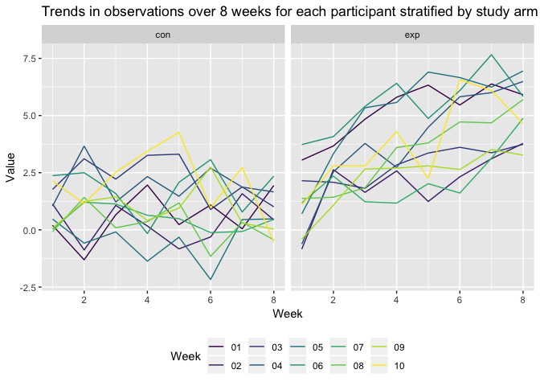
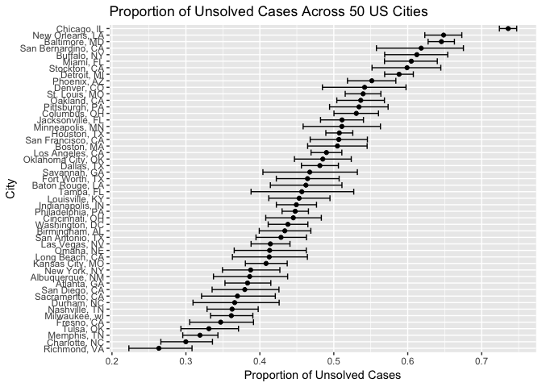

Yx2510\_p8105\_hw5
================
Yi Xiao
02/11/2018

Load the packages

``` r
library(tidyverse)
```

    ## ── Attaching packages ──────────────────────────────────────────────────────────────────── tidyverse 1.2.1 ──

    ## ✔ ggplot2 3.0.0     ✔ purrr   0.2.5
    ## ✔ tibble  1.4.2     ✔ dplyr   0.7.6
    ## ✔ tidyr   0.8.1     ✔ stringr 1.3.1
    ## ✔ readr   1.1.1     ✔ forcats 0.3.0

    ## ── Conflicts ─────────────────────────────────────────────────────────────────────── tidyverse_conflicts() ──
    ## ✖ dplyr::filter() masks stats::filter()
    ## ✖ dplyr::lag()    masks stats::lag()

``` r
library(ggplot2)
library(viridis)
```

    ## Loading required package: viridisLite

Problem one:
------------

##### Read the file:

#### 1. Start with a dataframe containing all file names

``` r
name = list.files(path = "./data", full.names = TRUE) %>% 
        as.data.frame()
        colnames(name) = "subject"
```

#### 2. Iterate over file names and read in data for each subject using purrr::map and saving the result as a new variable in the dataframe

``` r
data =  map(as.character(name$subject), read_csv) 
```

    ## Parsed with column specification:
    ## cols(
    ##   week_1 = col_double(),
    ##   week_2 = col_double(),
    ##   week_3 = col_double(),
    ##   week_4 = col_double(),
    ##   week_5 = col_double(),
    ##   week_6 = col_double(),
    ##   week_7 = col_double(),
    ##   week_8 = col_double()
    ## )
    ## Parsed with column specification:
    ## cols(
    ##   week_1 = col_double(),
    ##   week_2 = col_double(),
    ##   week_3 = col_double(),
    ##   week_4 = col_double(),
    ##   week_5 = col_double(),
    ##   week_6 = col_double(),
    ##   week_7 = col_double(),
    ##   week_8 = col_double()
    ## )
    ## Parsed with column specification:
    ## cols(
    ##   week_1 = col_double(),
    ##   week_2 = col_double(),
    ##   week_3 = col_double(),
    ##   week_4 = col_double(),
    ##   week_5 = col_double(),
    ##   week_6 = col_double(),
    ##   week_7 = col_double(),
    ##   week_8 = col_double()
    ## )
    ## Parsed with column specification:
    ## cols(
    ##   week_1 = col_double(),
    ##   week_2 = col_double(),
    ##   week_3 = col_double(),
    ##   week_4 = col_double(),
    ##   week_5 = col_double(),
    ##   week_6 = col_double(),
    ##   week_7 = col_double(),
    ##   week_8 = col_double()
    ## )
    ## Parsed with column specification:
    ## cols(
    ##   week_1 = col_double(),
    ##   week_2 = col_double(),
    ##   week_3 = col_double(),
    ##   week_4 = col_double(),
    ##   week_5 = col_double(),
    ##   week_6 = col_double(),
    ##   week_7 = col_double(),
    ##   week_8 = col_double()
    ## )
    ## Parsed with column specification:
    ## cols(
    ##   week_1 = col_double(),
    ##   week_2 = col_double(),
    ##   week_3 = col_double(),
    ##   week_4 = col_double(),
    ##   week_5 = col_double(),
    ##   week_6 = col_double(),
    ##   week_7 = col_double(),
    ##   week_8 = col_double()
    ## )
    ## Parsed with column specification:
    ## cols(
    ##   week_1 = col_double(),
    ##   week_2 = col_double(),
    ##   week_3 = col_double(),
    ##   week_4 = col_double(),
    ##   week_5 = col_double(),
    ##   week_6 = col_double(),
    ##   week_7 = col_double(),
    ##   week_8 = col_double()
    ## )
    ## Parsed with column specification:
    ## cols(
    ##   week_1 = col_double(),
    ##   week_2 = col_double(),
    ##   week_3 = col_double(),
    ##   week_4 = col_double(),
    ##   week_5 = col_double(),
    ##   week_6 = col_double(),
    ##   week_7 = col_double(),
    ##   week_8 = col_double()
    ## )
    ## Parsed with column specification:
    ## cols(
    ##   week_1 = col_double(),
    ##   week_2 = col_double(),
    ##   week_3 = col_double(),
    ##   week_4 = col_double(),
    ##   week_5 = col_double(),
    ##   week_6 = col_double(),
    ##   week_7 = col_double(),
    ##   week_8 = col_double()
    ## )
    ## Parsed with column specification:
    ## cols(
    ##   week_1 = col_double(),
    ##   week_2 = col_double(),
    ##   week_3 = col_double(),
    ##   week_4 = col_double(),
    ##   week_5 = col_double(),
    ##   week_6 = col_double(),
    ##   week_7 = col_double(),
    ##   week_8 = col_double()
    ## )
    ## Parsed with column specification:
    ## cols(
    ##   week_1 = col_double(),
    ##   week_2 = col_double(),
    ##   week_3 = col_double(),
    ##   week_4 = col_double(),
    ##   week_5 = col_double(),
    ##   week_6 = col_double(),
    ##   week_7 = col_double(),
    ##   week_8 = col_double()
    ## )
    ## Parsed with column specification:
    ## cols(
    ##   week_1 = col_double(),
    ##   week_2 = col_double(),
    ##   week_3 = col_double(),
    ##   week_4 = col_double(),
    ##   week_5 = col_double(),
    ##   week_6 = col_double(),
    ##   week_7 = col_double(),
    ##   week_8 = col_double()
    ## )
    ## Parsed with column specification:
    ## cols(
    ##   week_1 = col_double(),
    ##   week_2 = col_double(),
    ##   week_3 = col_double(),
    ##   week_4 = col_double(),
    ##   week_5 = col_double(),
    ##   week_6 = col_double(),
    ##   week_7 = col_double(),
    ##   week_8 = col_double()
    ## )

    ## Parsed with column specification:
    ## cols(
    ##   week_1 = col_double(),
    ##   week_2 = col_double(),
    ##   week_3 = col_double(),
    ##   week_4 = col_double(),
    ##   week_5 = col_double(),
    ##   week_6 = col_double(),
    ##   week_7 = col_integer(),
    ##   week_8 = col_double()
    ## )

    ## Parsed with column specification:
    ## cols(
    ##   week_1 = col_double(),
    ##   week_2 = col_double(),
    ##   week_3 = col_double(),
    ##   week_4 = col_double(),
    ##   week_5 = col_double(),
    ##   week_6 = col_double(),
    ##   week_7 = col_double(),
    ##   week_8 = col_double()
    ## )
    ## Parsed with column specification:
    ## cols(
    ##   week_1 = col_double(),
    ##   week_2 = col_double(),
    ##   week_3 = col_double(),
    ##   week_4 = col_double(),
    ##   week_5 = col_double(),
    ##   week_6 = col_double(),
    ##   week_7 = col_double(),
    ##   week_8 = col_double()
    ## )
    ## Parsed with column specification:
    ## cols(
    ##   week_1 = col_double(),
    ##   week_2 = col_double(),
    ##   week_3 = col_double(),
    ##   week_4 = col_double(),
    ##   week_5 = col_double(),
    ##   week_6 = col_double(),
    ##   week_7 = col_double(),
    ##   week_8 = col_double()
    ## )
    ## Parsed with column specification:
    ## cols(
    ##   week_1 = col_double(),
    ##   week_2 = col_double(),
    ##   week_3 = col_double(),
    ##   week_4 = col_double(),
    ##   week_5 = col_double(),
    ##   week_6 = col_double(),
    ##   week_7 = col_double(),
    ##   week_8 = col_double()
    ## )
    ## Parsed with column specification:
    ## cols(
    ##   week_1 = col_double(),
    ##   week_2 = col_double(),
    ##   week_3 = col_double(),
    ##   week_4 = col_double(),
    ##   week_5 = col_double(),
    ##   week_6 = col_double(),
    ##   week_7 = col_double(),
    ##   week_8 = col_double()
    ## )
    ## Parsed with column specification:
    ## cols(
    ##   week_1 = col_double(),
    ##   week_2 = col_double(),
    ##   week_3 = col_double(),
    ##   week_4 = col_double(),
    ##   week_5 = col_double(),
    ##   week_6 = col_double(),
    ##   week_7 = col_double(),
    ##   week_8 = col_double()
    ## )

``` r
data_combi = data[[1]]
for (i in 2:20) {
data_combi = rbind(data_combi, data[[i]])
}
my_data = cbind(name, data_combi)
```

#### 3. Tidy the data

``` r
 my_tidy_data = my_data %>%
        gather(key = week, value = value, week_1 : week_8) %>%
        mutate(subject = str_replace(subject, "./data/", ""),
               subject = str_replace(subject, ".csv", ""),
               week = str_replace(week, "week_", "")) %>%
        separate(subject, into = c("group", "subject_id"), sep = "_")
```

To import the separate 20 files, I first used `list.files` with `full.name` being `TRUE`. Then I created a dataframe containing all of those names and used `map` to iterate over the filenames and saved the results in a list named `data`. Each observation in the list was extracted and combined those recordings using `rbind` and add the subject id in front using `rbind`.

In the data tidying phase, I gathered the observation from week 1 to 8 under "week" variable and separate all subjects into control and experimental arms. In the final dataset I generated, there are 160observations and `ncol(my_tidy_data)` columns. Variables includes group, subject id, week and value.

#### 4. Make a spaghetti plot showing observations on each subject over time, and comment on differences between groups.

``` r
my_tidy_data %>%
        ggplot(aes(x = as.numeric(week), y = value)) +
        facet_grid(~ as.factor(group)) +
        geom_line(aes(color = subject_id)) +
        labs(x = "Week",
             y = "Value",
             title = "Trends in observations over 8 weeks for each participant stratified by study arm") +
        theme(legend.position = "bottom") +
        viridis::scale_color_viridis(name = "Week",
                               discrete = TRUE)  
```



Comment: The week-one value ranged from 0.0 to 2.5. A slightly wider range was observed in the experiment group which fell between -1.0 to 3.725. However, the value in the control arm remained stable arond this range for the following 8 weeks. Meanwhile, an overall increasing trend can be observed for the experimental group.

Problem 2:
----------

#### 1. read the data and create city\_state variable

``` r
homicide_data = read_csv("https://raw.githubusercontent.com/washingtonpost/data-homicides/master/homicide-data.csv") %>%
        janitor::clean_names() %>%
        unite(col = "city_state", city:state, sep = ", ", remove = FALSE)
```

    ## Parsed with column specification:
    ## cols(
    ##   uid = col_character(),
    ##   reported_date = col_integer(),
    ##   victim_last = col_character(),
    ##   victim_first = col_character(),
    ##   victim_race = col_character(),
    ##   victim_age = col_character(),
    ##   victim_sex = col_character(),
    ##   city = col_character(),
    ##   state = col_character(),
    ##   lat = col_double(),
    ##   lon = col_double(),
    ##   disposition = col_character()
    ## )

The data contains information on homicides across 50 US cities from 2007 to 2015. There are 'r nrow(homicide\_data)' recordings and 'r ncol(homicide\_data)' columns. Variables include name, race, age and sex of victims, city, state and location of crime, and also disposition of cases.

#### 2. summarize within cities to obtain the total number of homicides and the number of unsolved homicides

``` r
# total case in a city
homicide_total_crime = homicide_data %>%
        group_by(city_state) %>%
        summarise(city_total = n()) 
# unsolved case in a city 
homicide_unsolved = homicide_data %>%
        filter(disposition %in% c ("Closed without arrest", "Open/No arrest")) %>%
        group_by(city_state)  %>%
        summarise(unsolved = n())

# merge two table
all_cases = left_join(homicide_unsolved, homicide_total_crime, by = "city_state")
```

I first created two separate datasets containing the number of total cases and unsolved cases in each city. Then I joined the two datasets on `city_state` and save the result in `all_cases`.

#### 3. data for Baltimore, MD

``` r
 baltimore_data = all_cases %>%
        filter(city_state == "Baltimore, MD")

broom::tidy(
        prop.test(baltimore_data$unsolved, baltimore_data$city_total)
) %>%
        select(estimate, conf.low, conf.high) %>%
        mutate(estimate = round(estimate, 4),
               conf.low = round(conf.low, 4),
               conf.high = round(conf.high, 4)) %>%
        rename("Estimate"= estimate, 
               "Lower Bound" = conf.low,
                "Upper Bound" = conf.high) %>%
        knitr::kable()
```

|  Estimate|  Lower Bound|  Upper Bound|
|---------:|------------:|------------:|
|    0.6456|       0.6276|       0.6632|

#### 4. calculate the proportion for each city

``` r
unsolved_prop = function(x) {
        broom::tidy(prop.test(x$unsolved, x$city_total)) %>%
        select(estimate, conf.low, conf.high)
}
```

I first wrote a function taking the name of dataset as input and then runs `prop.test` using `unsolved` and `city_total` variables. The result is then get tidied up using `broom::tidy` and three variables are then selected to present.

``` r
unsolved_prop_data = nest(all_cases, unsolved:city_total) %>%
        mutate(unsolved_proportion = map(data, unsolved_prop)) %>% 
        unnest() %>%
        rename("conf_low" = conf.low,
               "conf_high" = conf.high,
               "unsolved_estimate" = estimate)      
```

I used `nest` to create a column named data which is actually a list with unsolved and city\_total nested inside. Then I used `map` to iterate over the column and add a variable named `unsolved proportion` to record the proportion of unsolved cases across 50 cities and their lower and higher confidence interval.

#### 5. make a plot

``` r
unsolved_prop_data %>%
        mutate(city_state = fct_reorder(city_state, unsolved_estimate)) %>%
        ggplot(aes(x = city_state, y = unsolved_estimate)) +
        geom_point() +
        geom_errorbar(aes(ymin = conf_low, ymax = conf_high)) +
        coord_flip() +
        labs(title = "Proportion of Unsolved Cases Across 50 US Cities",
             x = "City",
             y = "Proportion of Unsolved Cases",
             Caption = "Error bars indicates 95% confidence interval")
```

 The resulting plots showed the proption of unsolved cases in a descending order with their corresponding confidence interval. Chicago has the highest proportion of unsolved cases while Richmond has the lowest.
